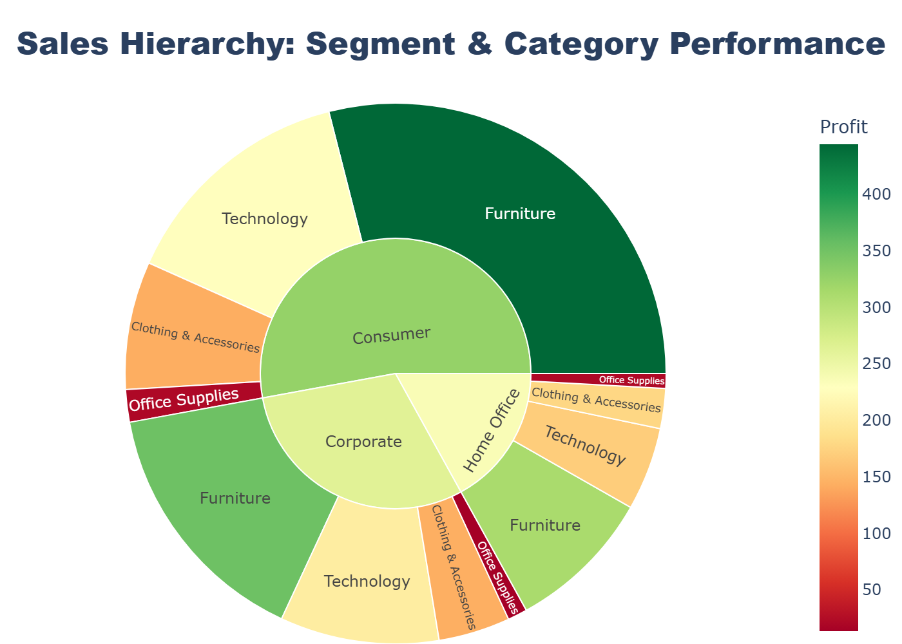

# Global E-commerce Sales Analysis

  <h3>Sales Hierarchy Map</h3>
  
  
<em>Visualization of the hierarchical distribution of sales performance across key product segments.</em>

---

## Project Overview
This project performs an end-to-end data analysis on a global e-commerce dataset of 51,290 records. The analysis covers data cleaning, exploratory data analysis (EDA), and advanced feature engineering to unlock deeper insights into sales performance and profitability.

### Key Objectives:
* Analyze the correlation between sales, quantities, and profitability.
* Visualize top-performing regions, markets, and categories.
* Implement hierarchical feature engineering to segment sales data.

---

## Data Analysis Highlights
The project successfully derived several key insights:

* **Regional Performance:** The **Central** and **Western Europe** regions are the dominant drivers of total sales.
* **Profitability:** There is a **0.62 correlation** between `Sales` and `Profit`, indicating that sales volume is a relatively strong predictor of profitability.
* **Top Categories:** The **Technology** category generated the highest total sales among the major product categories.

---

## Feature Engineering
To provide more granular insights, a custom `Sales_Hierarchy` feature was engineered. This metric divides sales into four prioritized tiers:
1. **Critical:** High-value transactions vital for overall revenue.
2. **Key High Value:** Major contributors to sales volume.
3. **Core Volume:** The standard transactional base.
4. **Standard Transaction:** Low-tier sales entries.

*The visualization at the top of this README shows how sales are distributed across these engineered hierarchy levels.*

---

## Tech Stack
* **Language:** Python
* **Libraries:** `Pandas`, `NumPy`, `Matplotlib`, `Seaborn`

---

## Project Structure
* `dataset/global_ecommerce_sales.csv`: The raw transaction data.
* `images/sales_hierarchy.png`: Visual representation of the engineered sales segments.
* `global_ecommerce_sales.ipynb`: The complete analysis code, visualizations, and results.

---

### Let's Connect!
[Nosheen Khan on LinkedIn](https://www.linkedin.com/in/khannosheen) | [Nosheen Khan on Kaggle](https://www.kaggle.com/nosheenkhan)

